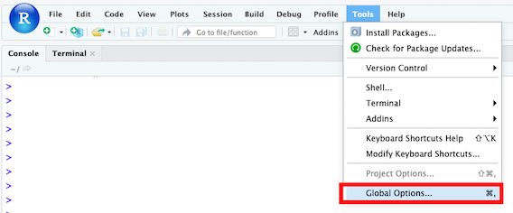
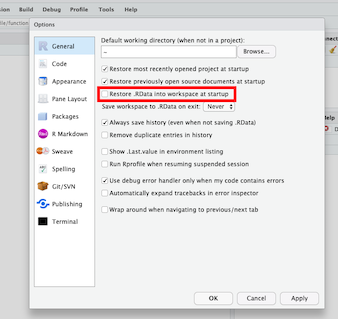

```{r setup, include=FALSE}
knitr::opts_chunk$set(echo = TRUE)
```

# Welcome!

This is a small R package that accompanies the MBL Neurobiology course 2019.
Most importantly, it contains helper functions to load the raw counts, gene and
sample annotations into R as a
[DGEList](https://www.rdocumentation.org/packages/edgeR/versions/3.14.0/topics/DGEList)
object.

## Installation

To install the package, you can you the `install_github` function from either the
[devtools](https://www.rstudio.com/products/rpackages/devtools/)
or
[remotes](https://cran.r-project.org/web/packages/remotes/index.html)
packages.

```{r results='hide'}
if (!require("remotes", quietly = TRUE)) {
  install.packages("remotes", quiet = TRUE)
}
remotes::install_github("tomsing1/mbl2019", subdir = "rmbl2019", upgrade = FALSE)
```

## Troubleshooting

### Preventing RStudio from restoring previous workspace

By default, RStudio is configured to automatically reload the contents of your
workspace into your R session each time. That can be quite confusing: old
variables and result objects persist across sessions, and you might confuse
them for your current outputs. 

We recommend that you deactive this default behavior via the 
`Tools -> Global options` menu, as shown below:

1. Open the `Global options` panel via the `Tools` menu:



2. Deactivate the `Restore .RData into workspace at startup` tickbox.



### Corrupt lazy-load database

If you try to update the package while it is already attached to your current
R session, you might see the following error message:

```
Error: lazy-load database '/home/ubuntu/R/x86_64-pc-linux-gnu-library/3.6/rmbl2019/R/rmbl2019.rdb' is corrupt.
```
Don't worry, this simply means that you need to either:

1) Unload the package and then attach its new version instead:

```r
detach("package:rmbl2019", unload = TRUE)
library(rmbl2019)
```

2) Alternatively, you can restart your R session via RStudio's
`Session -> New Session` menu item.


## Useful functions

The `mbl_load_data` function downloads previously created
[DGEList](https://www.rdocumentation.org/packages/edgeR/versions/3.14.0/topics/DGEList)
objects with data from experiment performed either 
- `pre_mbl`: before the MBL2019 started (fly, planaria, mouse and worm samples)
- `mbl`: at the MBL2019 course, e.g. from samples collected by the course
participants (fly, mouse and fish samples)

### Accessing pre-MBL datasets

The datasets are selected using the `organism` and `dataset` arguments.

The following code will retrieve the mouse RNA-seq data generated before the MBL course:

```{r}
library(rmbl2019)  # load the rmbl2019 package from your library
mbl_load_data(organism = "mouse", dataset = "pre_mbl")  # retrieve a DGEList with mouse data from the pre-mbl batch
```

### Accessing MBL datasets

To retrieve the second batch of data, e.g. generated from samples collected by
the course participants at MBL, you can specify the `dataset = "mbl"` 
argument instead:

```{r}
library(rmbl2019)  # load the rmbl2019 package from your library
  # retrieve a DGEList with mouse data from the pre-mbl batch
mbl_load_data(organism = "mouse", dataset = "mbl")
```

### PCA plots

The `mbl_plot_pca` function performs a 
[Principal Component Analysis](https://en.wikipedia.org/wiki/Principal_component_analysis)
and returns a
[ggplot2](https://ggplot2.tidyverse.org/)
plot with the first two dimensions. 

Any column available in the `$samples` slot of the `DGEList` can be used to
color the points via the `intgroup` argument - as long as the argument matches
the column name of an existing column in the `samples` table:

```{r}
library(rmbl2019)
x <- mbl_load_data(organism = "mouse", dataset = "pre_mbl")
mbl_plot_pca(x, intgroup = "sex")
```

By default, it considers the top 500 most variable genes (see the `ntop`
argument). Please refer to the documentation for more details (e.g. `help(mbl_plot_pca)`).

### Tidy CPMs

To facilitate the generation of visualizations with `ggplot2`, the `mbl_create_tidy_table` function
is provided.

It returns a 
[tidy](http://vita.had.co.nz/papers/tidy-data.pdf)
data.frame that contains all gene and sample annotations - alongside the gene expression measurments
as `counts per million (CPM)`.

```{r}
library(rmbl2019)
x <- mbl_load_data(organism = "mouse", dataset = "pre_mbl")
cpms <- mbl_create_tidy_table(x, log_transform = TRUE, prior.count = 1)
head(cpms)
```

By default, the CPMs are log2 transformed after addition of one pseudocount. To 
learn how to change these parameters, please check the function's help page:
`help(mbl_create_tidy_table)`.

The tidy `cpms` data.frame can now be passed to `ggplot2` (potentially after
filtering) to plot the normalized expression of one or more genes of interest:

```{r fig.width=5.5, fig.height=3.7}
library(ggplot2)
library(dplyr)
cpms %>%
  dplyr::filter(symbol %in% c("Gapdh", "Acta1")) %>%
  ggplot(aes(x = sex, y = cpm, color = side)) +
  geom_point() + 
  facet_grid(symbol ~ cell_type, scales = "free_y") +
  scale_color_manual(values = c(left = "firebrick", right = "navy"),
                     na.value = "darkgrey", name = "Side") +
  xlab("Sex") + 
  ylab("Normalized expression\nlog2(CPM + 1)") +
  theme_linedraw(base_size = 14)
```

