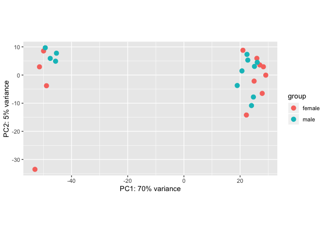

# Welcome!

This is a small R package that accompanies the MBL Neurobiology course 2019.
Most importantly, it contains helper functions to load the raw counts, gene and
sample annotations into R as a
[DGEList](https://www.rdocumentation.org/packages/edgeR/versions/3.14.0/topics/DGEList)
object.

## Installation

To install the package, you can you the `install_github` function from either the
[devtools](https://www.rstudio.com/products/rpackages/devtools/)
or
[remotes](https://cran.r-project.org/web/packages/remotes/index.html)
packages.


```r
if (!require("devtools", quietly = TRUE)) {
  install.packages("devtools", quiet = TRUE)
}
library(devtools)
install_github("tomsing1/mbl2019", subdir = "rmbl2019", upgrade = "never")
```

```
## Skipping install of 'rmbl2019' from a github remote, the SHA1 (895eafab) has not changed since last install.
##   Use `force = TRUE` to force installation
```

## Useful functions

The `mbl_load_data` function downloads previously created
[DGEList](https://www.rdocumentation.org/packages/edgeR/versions/3.14.0/topics/DGEList)
objects with data from both data generated 
- `pre_mbl`: before the MBL2019 started (fly, planaria, mouse and worm samples)
- `mbl`: at the MBL2019 course, e.g. from samples collected by the course participants (fly, mouse and fish samples)

### Accessing pre-MBL datasets

The datasets are selected using the `organism` and `dataset` arguments.

The following code will retrieve the mouse RNA-seq data generated before the MBL course:


```r
library(rmbl2019)  # load the rmbl2019 package from your library
mbl_load_data(organism = "mouse", dataset = "pre_mbl")  # retrieve a DGEList with mouse data from the pre-mbl batch
```

```
## An object of class "DGEList"
## $counts
##                       F1_SC     F1_TGL   F1_TGR      F2_SC     F2_TGL
## ENSMUSG00000000001 6.722588 136.375967 106.3516 82.7275351 155.064295
## ENSMUSG00000000003 0.000000   0.000000   0.0000  0.0000000   0.000000
## ENSMUSG00000000028 2.470033   5.157231   0.0000  2.5421892   6.245113
## ENSMUSG00000000037 0.000000   1.215573   0.0000  0.7355605   0.000000
## ENSMUSG00000000049 0.000000  13.117237   0.0000  0.0000000   1.650646
##                        F2_TGR      F3_SC     F3_TGL    F3_TGR     F4_SC
## ENSMUSG00000000001 230.055489 114.649705 145.757586 64.433167 50.286900
## ENSMUSG00000000003   0.000000   0.000000   0.000000  0.000000  0.000000
## ENSMUSG00000000028  20.804984   5.262041   9.930671  6.105890  5.071999
## ENSMUSG00000000037   2.073564   0.000000   1.221756  0.000000  0.000000
## ENSMUSG00000000049   0.000000   2.503461   4.932170  4.034624  0.000000
##                      F4_TGL     F4_TGR     M1_SC     M1_TGL   M1_TGR
## ENSMUSG00000000001 39.87178 165.356803 78.327305 169.084271 87.70119
## ENSMUSG00000000003  0.00000   0.000000  0.000000   0.000000  0.00000
## ENSMUSG00000000028 11.69297   9.119305  4.206106   5.158907  6.68338
## ENSMUSG00000000037  0.00000   1.223928  0.000000   3.587625  0.00000
## ENSMUSG00000000049  0.00000   4.117451  1.667577   2.454395  0.00000
##                        M2_SC     M2_TGL    M2_TGR     M3_SC     M3_TGL
## ENSMUSG00000000001 92.295393 170.153762 302.95020 40.392803 93.6615447
## ENSMUSG00000000003  0.000000   0.000000   0.00000  0.000000  0.0000000
## ENSMUSG00000000028  5.272533   6.229847  20.45510  2.116154  6.2869268
## ENSMUSG00000000037  2.097418   6.195597   0.00000  0.000000  0.0000000
## ENSMUSG00000000049  4.498391   8.545817   2.52108  0.000000  0.8308495
##                       M3_TGR      M4_SC     M4_TGL     M4_TGR
## ENSMUSG00000000001 125.38282 166.160031 321.016813 210.768356
## ENSMUSG00000000003   0.00000   0.000000   0.000000   0.000000
## ENSMUSG00000000028   0.00000   5.935517  17.788758  10.726247
## ENSMUSG00000000037   0.00000   0.000000   4.385829   3.083795
## ENSMUSG00000000049   4.10674   1.543963   1.666928   1.639169
## 33758 more rows ...
## 
## $samples
##        group  lib.size norm.factors plate sample_name organism  cell_type
## F1_SC      1  757409.4            1 MBL04       F1_SC    mouse spinalCord
## F1_TGL     1 1670071.4            1 MBL04      F1_TGL    mouse trigeminal
## F1_TGR     1 1322414.7            1 MBL04      F1_TGR    mouse trigeminal
## F2_SC      1 2275904.4            1 MBL04       F2_SC    mouse spinalCord
## F2_TGL     1 3176274.6            1 MBL04      F2_TGL    mouse trigeminal
##        animal_number    sex  side
## F1_SC              1 female  <NA>
## F1_TGL             1 female  left
## F1_TGR             1 female right
## F2_SC              2 female  <NA>
## F2_TGL             2 female  left
## 19 more rows ...
## 
## $genes
##                               gene_id      gene_type symbol entrezid
## ENSMUSG00000000001 ENSMUSG00000000001 protein_coding  Gnai3    14679
## ENSMUSG00000000003 ENSMUSG00000000003 protein_coding   Pbsn    54192
## ENSMUSG00000000028 ENSMUSG00000000028 protein_coding  Cdc45    12544
## ENSMUSG00000000037 ENSMUSG00000000037 protein_coding  Scml2   107815
## ENSMUSG00000000049 ENSMUSG00000000049 protein_coding   Apoh    11818
## 33758 more rows ...
```

To retrieve the second batch of data, e.g. generated from samples collected by the course participants, instead:


```r
library(rmbl2019)  # load the rmbl2019 package from your library
  # retrieve a DGEList with mouse data from the pre-mbl batch
mbl_load_data(organism = "mouse", dataset = "pre_mbl")
```

```
## An object of class "DGEList"
## $counts
##                       F1_SC     F1_TGL   F1_TGR      F2_SC     F2_TGL
## ENSMUSG00000000001 6.722588 136.375967 106.3516 82.7275351 155.064295
## ENSMUSG00000000003 0.000000   0.000000   0.0000  0.0000000   0.000000
## ENSMUSG00000000028 2.470033   5.157231   0.0000  2.5421892   6.245113
## ENSMUSG00000000037 0.000000   1.215573   0.0000  0.7355605   0.000000
## ENSMUSG00000000049 0.000000  13.117237   0.0000  0.0000000   1.650646
##                        F2_TGR      F3_SC     F3_TGL    F3_TGR     F4_SC
## ENSMUSG00000000001 230.055489 114.649705 145.757586 64.433167 50.286900
## ENSMUSG00000000003   0.000000   0.000000   0.000000  0.000000  0.000000
## ENSMUSG00000000028  20.804984   5.262041   9.930671  6.105890  5.071999
## ENSMUSG00000000037   2.073564   0.000000   1.221756  0.000000  0.000000
## ENSMUSG00000000049   0.000000   2.503461   4.932170  4.034624  0.000000
##                      F4_TGL     F4_TGR     M1_SC     M1_TGL   M1_TGR
## ENSMUSG00000000001 39.87178 165.356803 78.327305 169.084271 87.70119
## ENSMUSG00000000003  0.00000   0.000000  0.000000   0.000000  0.00000
## ENSMUSG00000000028 11.69297   9.119305  4.206106   5.158907  6.68338
## ENSMUSG00000000037  0.00000   1.223928  0.000000   3.587625  0.00000
## ENSMUSG00000000049  0.00000   4.117451  1.667577   2.454395  0.00000
##                        M2_SC     M2_TGL    M2_TGR     M3_SC     M3_TGL
## ENSMUSG00000000001 92.295393 170.153762 302.95020 40.392803 93.6615447
## ENSMUSG00000000003  0.000000   0.000000   0.00000  0.000000  0.0000000
## ENSMUSG00000000028  5.272533   6.229847  20.45510  2.116154  6.2869268
## ENSMUSG00000000037  2.097418   6.195597   0.00000  0.000000  0.0000000
## ENSMUSG00000000049  4.498391   8.545817   2.52108  0.000000  0.8308495
##                       M3_TGR      M4_SC     M4_TGL     M4_TGR
## ENSMUSG00000000001 125.38282 166.160031 321.016813 210.768356
## ENSMUSG00000000003   0.00000   0.000000   0.000000   0.000000
## ENSMUSG00000000028   0.00000   5.935517  17.788758  10.726247
## ENSMUSG00000000037   0.00000   0.000000   4.385829   3.083795
## ENSMUSG00000000049   4.10674   1.543963   1.666928   1.639169
## 33758 more rows ...
## 
## $samples
##        group  lib.size norm.factors plate sample_name organism  cell_type
## F1_SC      1  757409.4            1 MBL04       F1_SC    mouse spinalCord
## F1_TGL     1 1670071.4            1 MBL04      F1_TGL    mouse trigeminal
## F1_TGR     1 1322414.7            1 MBL04      F1_TGR    mouse trigeminal
## F2_SC      1 2275904.4            1 MBL04       F2_SC    mouse spinalCord
## F2_TGL     1 3176274.6            1 MBL04      F2_TGL    mouse trigeminal
##        animal_number    sex  side
## F1_SC              1 female  <NA>
## F1_TGL             1 female  left
## F1_TGR             1 female right
## F2_SC              2 female  <NA>
## F2_TGL             2 female  left
## 19 more rows ...
## 
## $genes
##                               gene_id      gene_type symbol entrezid
## ENSMUSG00000000001 ENSMUSG00000000001 protein_coding  Gnai3    14679
## ENSMUSG00000000003 ENSMUSG00000000003 protein_coding   Pbsn    54192
## ENSMUSG00000000028 ENSMUSG00000000028 protein_coding  Cdc45    12544
## ENSMUSG00000000037 ENSMUSG00000000037 protein_coding  Scml2   107815
## ENSMUSG00000000049 ENSMUSG00000000049 protein_coding   Apoh    11818
## 33758 more rows ...
```

### PCA plots

The `mbl_plot_pca` function performs a 
[Principal Component Analysis](https://en.wikipedia.org/wiki/Principal_component_analysis)
and returns a
[ggplot2](https://ggplot2.tidyverse.org/)
plot with the first two dimensions. 

Any column available in the `$samples` slot of the `DGEList` can be used to color the points
via the `intgroup` argument - as long as the argument matches the column name of an existing
column in the `samples` table:


```r
library(rmbl2019)
x <- mbl_load_data(organism = "mouse", dataset = "pre_mbl")
mbl_plot_pca(x, intgroup = "sex")
```

<!-- -->

By default, it considers the top 500 most variable genes (see the `ntop` argument).
Please refer to the documentation for more details (e.g. `help(mbl_plot_pca)`).

### Tidy CPMs

To facilitate the generation of visualizations with `ggplot2`, the `mbl_create_tidy_table` function
is provided.

It returns a 
[tidy](http://vita.had.co.nz/papers/tidy-data.pdf)
data.frame that contains all gene and sample annotations - alongside the gene expression measurments
as `counts per million (CPM)`.


```r
library(rmbl2019)
x <- mbl_load_data(organism = "mouse", dataset = "pre_mbl")
cpms <- mbl_create_tidy_table(x, log_transform = TRUE, prior.count = 1)
```

```
## Returning log2 transformed CPMs with 1 pseudocount(s)!
```

```r
head(cpms)
```

```
##              gene_id sample_id       cpm group lib.size norm.factors plate
## 1 ENSMUSG00000000001     F1_SC  3.227768     1 757409.4            1 MBL04
## 2 ENSMUSG00000000003     F1_SC -1.022046     1 757409.4            1 MBL04
## 3 ENSMUSG00000000028     F1_SC  1.908265     1 757409.4            1 MBL04
## 4 ENSMUSG00000000037     F1_SC -1.022046     1 757409.4            1 MBL04
## 5 ENSMUSG00000000049     F1_SC -1.022046     1 757409.4            1 MBL04
## 6 ENSMUSG00000000056     F1_SC  5.853845     1 757409.4            1 MBL04
##   sample_name organism  cell_type animal_number    sex side      gene_type
## 1       F1_SC    mouse spinalCord             1 female <NA> protein_coding
## 2       F1_SC    mouse spinalCord             1 female <NA> protein_coding
## 3       F1_SC    mouse spinalCord             1 female <NA> protein_coding
## 4       F1_SC    mouse spinalCord             1 female <NA> protein_coding
## 5       F1_SC    mouse spinalCord             1 female <NA> protein_coding
## 6       F1_SC    mouse spinalCord             1 female <NA> protein_coding
##   symbol entrezid
## 1  Gnai3    14679
## 2   Pbsn    54192
## 3  Cdc45    12544
## 4  Scml2   107815
## 5   Apoh    11818
## 6   Narf    67608
```

By default, the CPMs are log2 transformed after addition of one pseudocount. To 
learn how to change these parameters, please check the function's help page:
/Library/Frameworks/R.framework/Versions/3.6/Resources/library/rmbl2019/help/mbl_create_tidy_table.


