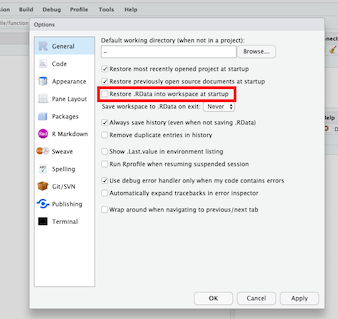

# Welcome!

This is a small R package that accompanies the MBL Neurobiology course 2019.
Most importantly, it contains helper functions to load the raw counts, gene and
sample annotations into R as a
[DGEList](https://www.rdocumentation.org/packages/edgeR/versions/3.14.0/topics/DGEList)
object.

## Installation

To install the package, you can you the `install_github` function from either the
[devtools](https://www.rstudio.com/products/rpackages/devtools/)
or
[remotes](https://cran.r-project.org/web/packages/remotes/index.html)
packages.


```r
if (!require("remotes", quietly = TRUE)) {
  install.packages("devtools", quiet = TRUE)
}
remotes::install_github("tomsing1/mbl2019", subdir = "rmbl2019",
                        upgrade = FALSE)
```

```
## Skipping install of 'rmbl2019' from a github remote, the SHA1 (6b16411f) has not changed since last install.
##   Use `force = TRUE` to force installation
```

## Troubleshooting

### Preventing RStudio from restoring previous workspace

By default, RStudio is configured to automatically reload the contents of your
workspace into your R session each time. That can be quite confusing: old
argument and results persist across sessions, and you might confuse them for
your current outputs. 

We recommend that you deactive this default behavior via the 
`Tools -> Global options` menu, as shown below:

1. Openthe `Global options` panel via the `Tools` menu:


2. Deactivate the `Restore .RData into workspace at startup` tickbox.



### Corrupt lazy-load database

If you try to update the package while it is already attached to your current
R session, you might see the following error message:

```
Error: lazy-load database '/home/ubuntu/R/x86_64-pc-linux-gnu-library/3.6/rmbl2019/R/rmbl2019.rdb' is corrupt.
```
Don't worry, this simply means that you need to either:

1) Unload the package and then attach it's new version instead:

```r
detach("package:rmbl2019", unload = TRUE)
library(rmbl2019)
```

2) Alternatively, you can restart your R session via RStudio's
`Session -> New Session` menu item.


## Useful functions

The `mbl_load_data` function downloads previously created
[DGEList](https://www.rdocumentation.org/packages/edgeR/versions/3.14.0/topics/DGEList)
objects with data from both data generated 
- `pre_mbl`: before the MBL2019 started (fly, planaria, mouse and worm samples)
- `mbl`: at the MBL2019 course, e.g. from samples collected by the course
participants (fly, mouse and fish samples)

### Accessing pre-MBL datasets

The datasets are selected using the `organism` and `dataset` arguments.

The following code will retrieve the mouse RNA-seq data generated before the MBL course:


```r
library(rmbl2019)  # load the rmbl2019 package from your library
mbl_load_data(organism = "mouse", dataset = "pre_mbl")  # retrieve a DGEList with mouse data from the pre-mbl batch
```

```
## An object of class "DGEList"
## $counts
##                       F1_SC     F1_TGL   F1_TGR      F2_SC     F2_TGL
## ENSMUSG00000000001 6.722588 136.375967 106.3516 82.7275351 155.064295
## ENSMUSG00000000003 0.000000   0.000000   0.0000  0.0000000   0.000000
## ENSMUSG00000000028 2.470033   5.157231   0.0000  2.5421892   6.245113
## ENSMUSG00000000037 0.000000   1.215573   0.0000  0.7355605   0.000000
## ENSMUSG00000000049 0.000000  13.117237   0.0000  0.0000000   1.650646
##                        F2_TGR      F3_SC     F3_TGL    F3_TGR     F4_SC
## ENSMUSG00000000001 230.055489 114.649705 145.757586 64.433167 50.286900
## ENSMUSG00000000003   0.000000   0.000000   0.000000  0.000000  0.000000
## ENSMUSG00000000028  20.804984   5.262041   9.930671  6.105890  5.071999
## ENSMUSG00000000037   2.073564   0.000000   1.221756  0.000000  0.000000
## ENSMUSG00000000049   0.000000   2.503461   4.932170  4.034624  0.000000
##                      F4_TGL     F4_TGR     M1_SC     M1_TGL   M1_TGR
## ENSMUSG00000000001 39.87178 165.356803 78.327305 169.084271 87.70119
## ENSMUSG00000000003  0.00000   0.000000  0.000000   0.000000  0.00000
## ENSMUSG00000000028 11.69297   9.119305  4.206106   5.158907  6.68338
## ENSMUSG00000000037  0.00000   1.223928  0.000000   3.587625  0.00000
## ENSMUSG00000000049  0.00000   4.117451  1.667577   2.454395  0.00000
##                        M2_SC     M2_TGL    M2_TGR     M3_SC     M3_TGL
## ENSMUSG00000000001 92.295393 170.153762 302.95020 40.392803 93.6615447
## ENSMUSG00000000003  0.000000   0.000000   0.00000  0.000000  0.0000000
## ENSMUSG00000000028  5.272533   6.229847  20.45510  2.116154  6.2869268
## ENSMUSG00000000037  2.097418   6.195597   0.00000  0.000000  0.0000000
## ENSMUSG00000000049  4.498391   8.545817   2.52108  0.000000  0.8308495
##                       M3_TGR      M4_SC     M4_TGL     M4_TGR
## ENSMUSG00000000001 125.38282 166.160031 321.016813 210.768356
## ENSMUSG00000000003   0.00000   0.000000   0.000000   0.000000
## ENSMUSG00000000028   0.00000   5.935517  17.788758  10.726247
## ENSMUSG00000000037   0.00000   0.000000   4.385829   3.083795
## ENSMUSG00000000049   4.10674   1.543963   1.666928   1.639169
## 33758 more rows ...
## 
## $samples
##        group  lib.size norm.factors plate sample_name organism  cell_type
## F1_SC      1  757409.4            1 MBL04       F1_SC    mouse spinalCord
## F1_TGL     1 1670071.4            1 MBL04      F1_TGL    mouse trigeminal
## F1_TGR     1 1322414.7            1 MBL04      F1_TGR    mouse trigeminal
## F2_SC      1 2275904.4            1 MBL04       F2_SC    mouse spinalCord
## F2_TGL     1 3176274.6            1 MBL04      F2_TGL    mouse trigeminal
##        animal_number    sex  side
## F1_SC              1 female  <NA>
## F1_TGL             1 female  left
## F1_TGR             1 female right
## F2_SC              2 female  <NA>
## F2_TGL             2 female  left
## 19 more rows ...
## 
## $genes
##                               gene_id      gene_type symbol entrezid
## ENSMUSG00000000001 ENSMUSG00000000001 protein_coding  Gnai3    14679
## ENSMUSG00000000003 ENSMUSG00000000003 protein_coding   Pbsn    54192
## ENSMUSG00000000028 ENSMUSG00000000028 protein_coding  Cdc45    12544
## ENSMUSG00000000037 ENSMUSG00000000037 protein_coding  Scml2   107815
## ENSMUSG00000000049 ENSMUSG00000000049 protein_coding   Apoh    11818
## 33758 more rows ...
```

### Accessing MBL datasets

To retrieve the second batch of data, e.g. generated from samples collected by
the course participants at MBL, you can specify the `dataset = "mbl"` 
argument instead:


```r
library(rmbl2019)  # load the rmbl2019 package from your library
  # retrieve a DGEList with mouse data from the pre-mbl batch
mbl_load_data(organism = "mouse", dataset = "mbl")
```

```
## An object of class "DGEList"
## $counts
##                    A1      A10       A11 A12      A13      A14 A15
## ENSMUSG00000000001  0 11.12889 0.8991318   0 32.47329 2.779383   0
## ENSMUSG00000000003  0  0.00000 0.0000000   0  0.00000 0.000000   0
## ENSMUSG00000000028  0  0.00000 0.0000000   0  0.00000 0.000000   0
## ENSMUSG00000000037  0  0.00000 0.0000000   0  0.00000 0.000000   0
## ENSMUSG00000000049  0  0.00000 0.0000000   0  0.00000 0.000000   0
##                         A16      A17       A18 A19       A2 A20      A21
## ENSMUSG00000000001 10.24641 14.18276 0.9278073   0 5.539280   0 25.56808
## ENSMUSG00000000003  0.00000  0.00000 0.0000000   0 0.000000   0  0.00000
## ENSMUSG00000000028  0.00000  0.00000 0.0000000   0 0.000000   0 17.72557
## ENSMUSG00000000037  0.00000  0.00000 0.0000000   0 0.000000   0  0.00000
## ENSMUSG00000000049  0.00000  0.00000 0.0000000   0 5.109005   0  0.00000
##                          A22       A23       A24 A25      A26      A27
## ENSMUSG00000000001 37.663542 22.747572 51.445012   0 16.39453 22.48561
## ENSMUSG00000000003  0.000000  0.000000  0.000000   0  0.00000  0.00000
## ENSMUSG00000000028  1.766908  0.000000  0.000000   0  0.00000  0.00000
## ENSMUSG00000000037  0.000000  0.000000  0.000000   0  0.00000  0.00000
## ENSMUSG00000000049  7.758041  0.874192  4.313538   0  0.00000  0.00000
##                         A28      A29       A3        A30        A31
## ENSMUSG00000000001 28.87883 13.39862 5.116909 41.2275918 127.259214
## ENSMUSG00000000003  0.00000  0.00000 0.000000  0.0000000   0.000000
## ENSMUSG00000000028  0.00000  0.00000 0.000000  0.9445649   3.687419
## ENSMUSG00000000037  0.00000  0.00000 0.000000  0.0000000   0.000000
## ENSMUSG00000000049 23.10619  0.00000 0.000000  0.8843060   0.000000
##                          A38 A39       A4 A40 A41 A42 A43      A44 A45 A46
## ENSMUSG00000000001 174.89577   0 30.22045   0   0   0   0 4.485591   0   0
## ENSMUSG00000000003   0.00000   0  0.00000   0   0   0   0 0.000000   0   0
## ENSMUSG00000000028   0.00000   0  0.00000   0   0   0   0 0.000000   0   0
## ENSMUSG00000000037   0.00000   0  0.00000   0   0   0   0 0.000000   0   0
## ENSMUSG00000000049  30.68404   0  0.00000   0   0   0   0 0.000000   0   0
##                         A47      A48 A49         A5      A50      A51
## ENSMUSG00000000001 5.620881 4.647571   0 91.1901911 1.833394 14.78647
## ENSMUSG00000000003 0.000000 0.000000   0  0.0000000 0.000000  0.00000
## ENSMUSG00000000028 0.000000 0.000000   0  0.0000000 0.000000  0.00000
## ENSMUSG00000000037 0.000000 0.000000   0  0.0000000 0.000000  0.00000
## ENSMUSG00000000049 0.000000 0.000000   0  0.8670807 0.000000  0.00000
##                          A52       A53 A54      A55      A56       A57
## ENSMUSG00000000001 20.047451 0.9408149   0 26.58778 1.716426 15.066001
## ENSMUSG00000000003  0.000000 0.0000000   0  0.00000 0.000000  0.000000
## ENSMUSG00000000028  2.821456 0.0000000   0  0.00000 0.000000  0.000000
## ENSMUSG00000000037  0.000000 0.0000000   0  0.00000 0.000000  0.000000
## ENSMUSG00000000049  0.000000 0.0000000   0  0.00000 0.000000  2.605447
##                          A58      A59       A6      A60      A61 A62   A63
## ENSMUSG00000000001 0.8391894 0.935168 7.364716 5.622618 21.90554   0 15.25
## ENSMUSG00000000003 0.0000000 0.000000 0.000000 0.000000  0.00000   0  0.00
## ENSMUSG00000000028 0.0000000 0.000000 0.000000 0.000000  0.00000   0  0.00
## ENSMUSG00000000037 0.0000000 0.000000 0.000000 1.765100  0.00000   0  0.00
## ENSMUSG00000000049 0.0000000 0.000000 0.000000 0.000000  0.00000   0  0.00
##                    A64      A65      A66       A67 A68 A69       A7
## ENSMUSG00000000001   0 4.729252 13.31068 62.389521   0   0 6.363069
## ENSMUSG00000000003   0 0.000000  0.00000  0.000000   0   0 0.000000
## ENSMUSG00000000028   0 0.000000  0.00000  0.000000   0   0 0.000000
## ENSMUSG00000000037   0 0.000000  0.00000  0.000000   0   0 0.000000
## ENSMUSG00000000049   0 0.000000  0.00000  2.538675   0   0 0.000000
##                         A70        A71      A74     A78 A79         A8
## ENSMUSG00000000001 9.892636 10.0479177 3.485179 12.2725   0 14.4772943
## ENSMUSG00000000003 0.000000  0.0000000 0.000000  0.0000   0  0.0000000
## ENSMUSG00000000028 0.000000  0.0000000 0.000000  0.0000   0  0.0000000
## ENSMUSG00000000037 0.000000  0.0000000 0.000000  0.0000   0  0.0000000
## ENSMUSG00000000049 0.000000  0.7722854 0.000000  0.0000   0  0.8345464
##                          A80 A81 A82 A83      A84     A85       A86 A87
## ENSMUSG00000000001 3.7281012   0   0   0 6.661054 7.55624 24.845791   0
## ENSMUSG00000000003 0.0000000   0   0   0 0.000000 0.00000  0.000000   0
## ENSMUSG00000000028 0.9182056   0   0   0 0.000000 0.00000  0.000000   0
## ENSMUSG00000000037 0.0000000   0   0   0 0.000000 0.00000  0.000000   0
## ENSMUSG00000000049 0.0000000   0   0   0 0.000000 0.00000  1.615658   0
##                          A88      A89        A9 A90       A91        P1
## ENSMUSG00000000001  3.789573 6.677185 0.9166902   0 0.8240718 0.8732098
## ENSMUSG00000000003  0.000000 0.000000 0.0000000   0 0.0000000 0.0000000
## ENSMUSG00000000028  0.000000 0.000000 0.0000000   0 0.0000000 0.0000000
## ENSMUSG00000000037  0.000000 0.000000 0.0000000   0 0.0000000 0.0000000
## ENSMUSG00000000049 23.592667 0.000000 0.0000000   0 0.0000000 0.0000000
##                    P10      P11 P12 P13       P14       P15      P16
## ENSMUSG00000000001   0 0.000000   0   0 0.8631647 0.8150117 4.500572
## ENSMUSG00000000003   0 0.000000   0   0 0.0000000 0.0000000 0.000000
## ENSMUSG00000000028   0 1.932992   0   0 2.0438356 0.0000000 0.000000
## ENSMUSG00000000037   0 0.453675   0   0 0.8129160 0.0000000 0.000000
## ENSMUSG00000000049   0 0.000000   0   0 0.0000000 0.7517040 0.000000
##                          P2 P3        P4 P5 P6 P7 P8       P9         S1
## ENSMUSG00000000001 25.26638  0 0.8846893  0  0  0  0 24.17381 194.145858
## ENSMUSG00000000003  0.00000  0 0.0000000  0  0  0  0  0.00000   0.000000
## ENSMUSG00000000028  0.00000  0 0.0000000  0  0  0  0  0.00000   4.053490
## ENSMUSG00000000037  0.00000  0 0.0000000  0  0  0  0  0.00000   0.000000
## ENSMUSG00000000049  0.00000  0 0.0000000  0  0  0  0  0.00000   2.376972
##                           S10        S11        S12        S13         S14
## ENSMUSG00000000001 84.3710954 190.209932 70.9046540 241.189196 300.0645053
## ENSMUSG00000000003  0.0000000   0.000000  0.0000000   0.000000   0.0000000
## ENSMUSG00000000028  1.6963278   0.855659  2.0227812   7.651425   4.2842773
## ENSMUSG00000000037  0.0000000   0.000000 13.1369166   0.000000   0.8191199
## ENSMUSG00000000049  0.7940549   1.602146  0.7879156   1.588960   8.0219244
##                           S15        S16         S17        S18        S19
## ENSMUSG00000000001 193.407623 90.0245027 374.9441040 251.960593 223.779469
## ENSMUSG00000000003   0.000000  0.0000000   0.0000000   0.000000   0.000000
## ENSMUSG00000000028   2.551872 10.2334213   9.5287242   4.099623   5.399052
## ENSMUSG00000000037   0.000000  0.0000000   0.8136309   0.000000   3.553201
## ENSMUSG00000000049   2.389075  0.7983813   0.0000000   3.205367   0.000000
##                            S2         S20         S21         S22
## ENSMUSG00000000001 106.814914 348.0761770 394.3837521 406.8168243
## ENSMUSG00000000003   0.000000   0.0000000   0.8667774   0.0000000
## ENSMUSG00000000028   5.011005   4.2651109   8.8615394   6.1133427
## ENSMUSG00000000037   0.000000   0.6656726   0.9633954   3.2537957
## ENSMUSG00000000049   0.000000   2.3958117   1.5988975   0.7966386
##                           S23         S24         S3         S4         S5
## ENSMUSG00000000001 248.132541 293.6663275 178.818483 272.882462 176.194161
## ENSMUSG00000000003   0.000000   0.0000000   0.000000   0.000000   0.000000
## ENSMUSG00000000028   5.983122  13.0595051  11.111167  10.900420   3.237473
## ENSMUSG00000000037   0.000000   0.0000000   0.000000  11.949954   0.000000
## ENSMUSG00000000049   7.505815   0.8061173   3.141493   7.191021   3.037532
##                             S6         S7         S8         S9
## ENSMUSG00000000001 203.6176791 205.159311 420.149260 142.816320
## ENSMUSG00000000003   0.0000000   0.000000   0.000000   0.000000
## ENSMUSG00000000028  13.4856130  10.105864  11.257482   3.410877
## ENSMUSG00000000037   0.8057322   0.000000   0.000000   0.000000
## ENSMUSG00000000049   2.3672430   1.576859   1.591431   5.891503
## 33758 more rows ...
## 
## $samples
##     group   lib.size norm.factors plate sample_name organism cell_type
## A1      1   7611.349            1 MBL07          A1    mouse       DRG
## A10     1 109645.000            1 MBL07         A10    mouse       DRG
## A11     1  56245.245            1 MBL07         A11    mouse       DRG
## A12     1  10879.962            1 MBL07         A12    mouse       DRG
## A13     1 267946.794            1 MBL07         A13    mouse       DRG
##     animal_number    sex cell_number treatment associated_image_file notes
## A1              2 female           1      <NA>                  <NA>  <NA>
## A10             2 female           1      <NA>                  <NA>  <NA>
## A11             2 female           1      <NA>                  <NA>  <NA>
## A12             2 female           1      <NA>                  <NA>  <NA>
## A13             2 female           1      <NA>                  <NA>  <NA>
## 115 more rows ...
## 
## $genes
##                               gene_id      gene_type symbol entrezid
## ENSMUSG00000000001 ENSMUSG00000000001 protein_coding  Gnai3    14679
## ENSMUSG00000000003 ENSMUSG00000000003 protein_coding   Pbsn    54192
## ENSMUSG00000000028 ENSMUSG00000000028 protein_coding  Cdc45    12544
## ENSMUSG00000000037 ENSMUSG00000000037 protein_coding  Scml2   107815
## ENSMUSG00000000049 ENSMUSG00000000049 protein_coding   Apoh    11818
## 33758 more rows ...
```

### PCA plots

The `mbl_plot_pca` function performs a 
[Principal Component Analysis](https://en.wikipedia.org/wiki/Principal_component_analysis)
and returns a
[ggplot2](https://ggplot2.tidyverse.org/)
plot with the first two dimensions. 

Any column available in the `$samples` slot of the `DGEList` can be used to
color the points via the `intgroup` argument - as long as the argument matches
the column name of an existing column in the `samples` table:


```r
library(rmbl2019)
x <- mbl_load_data(organism = "mouse", dataset = "pre_mbl")
mbl_plot_pca(x, intgroup = "sex")
```

<!-- -->

By default, it considers the top 500 most variable genes (see the `ntop`
argument). Please refer to the documentation for more details (e.g. `help(mbl_plot_pca)`).

### Tidy CPMs

To facilitate the generation of visualizations with `ggplot2`, the `mbl_create_tidy_table` function
is provided.

It returns a 
[tidy](http://vita.had.co.nz/papers/tidy-data.pdf)
data.frame that contains all gene and sample annotations - alongside the gene expression measurments
as `counts per million (CPM)`.


```r
library(rmbl2019)
x <- mbl_load_data(organism = "mouse", dataset = "pre_mbl")
cpms <- mbl_create_tidy_table(x, log_transform = TRUE, prior.count = 1)
```

```
## Returning log2 transformed CPMs with 1 pseudocount(s)!
```

```r
head(cpms)
```

```
##              gene_id sample_id       cpm group lib.size norm.factors plate
## 1 ENSMUSG00000000001     F1_SC  3.227768     1 757409.4            1 MBL04
## 2 ENSMUSG00000000003     F1_SC -1.022046     1 757409.4            1 MBL04
## 3 ENSMUSG00000000028     F1_SC  1.908265     1 757409.4            1 MBL04
## 4 ENSMUSG00000000037     F1_SC -1.022046     1 757409.4            1 MBL04
## 5 ENSMUSG00000000049     F1_SC -1.022046     1 757409.4            1 MBL04
## 6 ENSMUSG00000000056     F1_SC  5.853845     1 757409.4            1 MBL04
##   sample_name organism  cell_type animal_number    sex side      gene_type
## 1       F1_SC    mouse spinalCord             1 female <NA> protein_coding
## 2       F1_SC    mouse spinalCord             1 female <NA> protein_coding
## 3       F1_SC    mouse spinalCord             1 female <NA> protein_coding
## 4       F1_SC    mouse spinalCord             1 female <NA> protein_coding
## 5       F1_SC    mouse spinalCord             1 female <NA> protein_coding
## 6       F1_SC    mouse spinalCord             1 female <NA> protein_coding
##   symbol entrezid
## 1  Gnai3    14679
## 2   Pbsn    54192
## 3  Cdc45    12544
## 4  Scml2   107815
## 5   Apoh    11818
## 6   Narf    67608
```

By default, the CPMs are log2 transformed after addition of one pseudocount. To 
learn how to change these parameters, please check the function's help page:
`help(mbl_create_tidy_table)`.

The tidy `cpms` data.frame can now be passed to `ggplot2` (potentially after
filtering) to plot the normalized expression of one or more genes of interest:


```r
library(ggplot2)
library(dplyr)
```

```
## 
## Attaching package: 'dplyr'
```

```
## The following objects are masked from 'package:stats':
## 
##     filter, lag
```

```
## The following objects are masked from 'package:base':
## 
##     intersect, setdiff, setequal, union
```

```r
cpms %>%
  dplyr::filter(symbol %in% c("Gapdh", "Acta1")) %>%
  ggplot(aes(x = sex, y = cpm, color = side)) +
  geom_point() + 
  facet_grid(symbol ~ cell_type, scales = "free_y") +
  scale_color_manual(values = c(left = "firebrick", right = "navy"),
                     na.value = "darkgrey", name = "Side") +
  xlab("Sex") + 
  ylab("Normalized expression\nlog2(CPM + 1)") +
  theme_linedraw(base_size = 14)
```

<!-- -->

